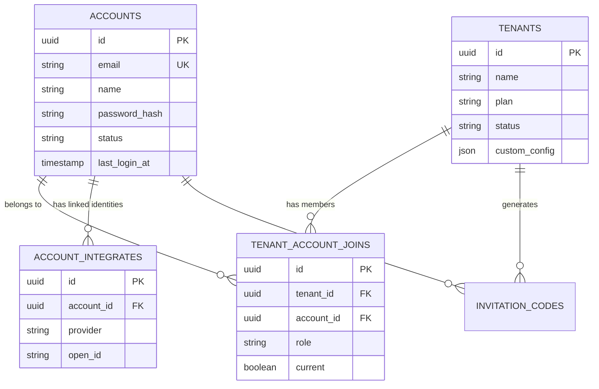

# Database Design: User & Tenant System

## Overview
This document outlines the database schema for the User and Tenant system, modeled after the [Dify](https://github.com/langgenius/dify) architecture. The system supports multi-tenancy, allowing users to belong to multiple workspaces (tenants) with different roles.

## Core Concepts
- **Account (User)**: A registered user of the platform.
- **Tenant (Workspace)**: An isolated environment where resources (apps, knowledge bases, etc.) are stored.
- **TenantAccountJoin (Membership)**: The association between a user and a tenant, defining the user's role within that specific tenant.

## Entity-Relationship Diagram (ERD)

## Detailed Schema

### 1. Accounts (`accounts`)
Stores user identity and authentication information.

| Column | Type | Nullable | Description |
|--------|------|----------|-------------|
| `id` | UUID | No | Primary Key |
| `email` | VARCHAR(255) | No | Unique email address |
| `name` | VARCHAR(255) | No | Display name |
| `password` | VARCHAR(255) | Yes | Hashed password (null if using SSO only) |
| `password_salt` | VARCHAR(255) | Yes | Salt for password hashing |
| `avatar` | VARCHAR(255) | Yes | URL to avatar image |
| `interface_language` | VARCHAR(255) | Yes | User's preferred language |
| `timezone` | VARCHAR(255) | Yes | User's timezone |
| `last_login_at` | TIMESTAMP | Yes | Timestamp of last login |
| `last_login_ip` | VARCHAR(255) | Yes | IP address of last login |
| `status` | VARCHAR(16) | No | Status: `active`, `banned`, `closed`, etc. |
| `created_at` | TIMESTAMP | No | Creation time |
| `updated_at` | TIMESTAMP | No | Last update time |

### 2. Tenants (`tenants`)
Represents a workspace or organization.

| Column | Type | Nullable | Description |
|--------|------|----------|-------------|
| `id` | UUID | No | Primary Key |
| `name` | VARCHAR(255) | No | Tenant name |
| `plan` | VARCHAR(255) | No | Subscription plan (e.g., `basic`, `pro`) |
| `status` | VARCHAR(255) | No | Status: `normal`, `archive` |
| `encrypt_public_key` | TEXT | Yes | RSA public key for encrypting secrets |
| `custom_config` | TEXT | Yes | JSON string for custom configurations |
| `created_at` | TIMESTAMP | No | Creation time |
| `updated_at` | TIMESTAMP | No | Last update time |

### 3. Tenant Memberships (`tenant_account_joins`)
Links users to tenants and assigns roles.

| Column | Type | Nullable | Description |
|--------|------|----------|-------------|
| `id` | UUID | No | Primary Key |
| `tenant_id` | UUID | No | Foreign Key to `tenants` |
| `account_id` | UUID | No | Foreign Key to `accounts` |
| `role` | VARCHAR(16) | No | Role: `owner`, `admin`, `editor`, `normal` |
| `current` | BOOLEAN | No | Whether this is the user's currently active tenant context |
| `invited_by` | UUID | Yes | ID of the user who invited this member |
| `created_at` | TIMESTAMP | No | Join time |
| `updated_at` | TIMESTAMP | No | Last update time |

### 4. Account Integrations (`account_integrates`)
Stores OAuth/SSO links (e.g., GitHub, Google).

| Column | Type | Nullable | Description |
|--------|------|----------|-------------|
| `id` | UUID | No | Primary Key |
| `account_id` | UUID | No | Foreign Key to `accounts` |
| `provider` | VARCHAR(16) | No | Provider name (e.g., `google`, `github`) |
| `open_id` | VARCHAR(255) | No | Unique ID from the provider |
| `encrypted_token` | VARCHAR(255) | No | Encrypted access token |
| `created_at` | TIMESTAMP | No | Link time |

### 5. Invitation Codes (`invitation_codes`)
Manages invitations to join tenants.

| Column | Type | Nullable | Description |
|--------|------|----------|-------------|
| `id` | INTEGER | No | Primary Key |
| `code` | VARCHAR(32) | No | Unique invitation code |
| `batch` | VARCHAR(255) | No | Batch identifier for bulk invites |
| `status` | VARCHAR(16) | No | Status: `unused`, `used` |
| `used_at` | TIMESTAMP | Yes | When the code was used |
| `used_by_tenant_id` | UUID | Yes | Tenant ID associated with the invite |
| `used_by_account_id` | UUID | Yes | Account ID that used the invite |

## Roles & Permissions
Based on `TenantAccountRole`:
- **Owner**: Full access to tenant, billing, and member management.
- **Admin**: Can manage apps and members, but not billing/owner transfer.
- **Editor**: Can build and edit apps.
- **Normal**: Read-only or limited execution access.
